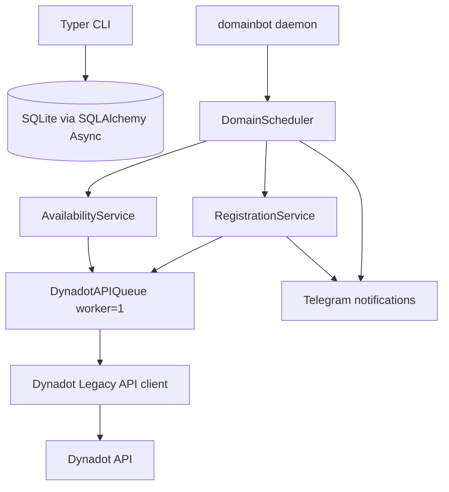

# Dynadot DomainBot Design

Updated: 2026-08-15

This project implements a long-running Dynadot domain monitoring and automatic registration daemon. The production path intentionally avoids WHOIS, RDAP, browser automation, Selenium, Playwright, and web page clicking. The source of truth for "can Dynadot register this right now?" is Dynadot Search. Registration is Dynadot Register.

## Official API Basis

Dynadot currently publishes both:

- RESTful v2 docs: `https://www.dynadot.com/domain/api-document`
- Legacy Domain API commands: `https://www.dynadot.com/domain/api-commands`

The RESTful v2 docs mark that API as Beta and advise against relying on it for critical production workflows. This system therefore defaults to the official Legacy `api3.json` API:

- Live base URL: `https://api.dynadot.com/api3.json`
- Sandbox base URL: `https://api-sandbox.dynadot.com/api3.json`
- Authentication: `key=<DYNADOT_API_KEY>` query parameter plus `command=<command>`
- Search: `command=search&domain0=<domain>&show_price=1&currency=USD`
- Register: `command=register&domain=<domain>&duration=<years>&currency=USD`, with `premium=1` when a premium result is accepted

Dynadot requires API access to be enabled and the server IP to be whitelisted. The VPS should use a fixed public IP. The README includes the operational setup steps.

## Architecture



Only `DynadotAPIQueue` sends Dynadot API calls. The queue has one worker, priority ordering, and a configurable minimum request spacing derived from the official rate limit.

Priorities:

- `REGISTER = 0`
- `STATUS_CONFIRM = 1`
- `SEARCH = 10`

The scheduler does not enqueue batches of searches. It picks one domain, waits for the search to complete, then either schedules the next check or immediately enters registration.

## Database

Default database: `sqlite+aiosqlite:///domainbot.db`

Tables:

- `domains`
- `registration_attempts`
- `availability_checks`

The domain table stores per-domain schedule state, including `start_at`, `window_end`, `interval_seconds`, `effective_interval_seconds`, `next_check_at`, `last_check_at`, `registration_years`, `max_price`, counters, order id, and last error.

`availability_checks` is pruned per domain with `MAX_CHECK_HISTORY_PER_DOMAIN`, default `1000`.

## State Machine

Statuses:

- `pending`
- `scheduled`
- `watching`
- `available`
- `registering`
- `registration_pending_confirmation`
- `registered`
- `taken`
- `paused`
- `expired`
- `price_exceeded`
- `error`
- `disabled`

Important transitions:

- `pending -> scheduled -> watching -> available -> registering -> registered`
- `watching -> expired`
- `watching -> price_exceeded`
- `registering -> registration_pending_confirmation`
- `registration_pending_confirmation -> registered`
- `registration_pending_confirmation -> watching` only when confirmation clearly indicates no registration exists
- `registered` is terminal for monitoring

All transitions are centralized in `domainbot/state_machine.py`.

## Scheduler

The scheduler queries the next due domain:

1. Enabled domain.
2. Active status.
3. `next_check_at <= now`.
4. Ordered by `next_check_at`, then `id`.

It never scans all domains every interval. Each domain owns its own `next_check_at`.

After an unavailable result:

```text
next_check_at = max(
    previous_next_check_at + effective_interval_seconds,
    completed_at + dynadot_min_safe_interval_seconds
)
```

The value is capped at `window_end`, so the next scheduler pass expires the window instead of sending a late search.

This prevents catch-up storms after a VPS restart or downtime.

## Registration Safety

Before a Register API request:

1. A database transaction loads the domain.
2. If status is `registered`, `registering`, `registration_pending_confirmation`, `paused`, `disabled`, or `price_exceeded`, the request exits.
3. If formal attempts exceed `REGISTER_MAX_ATTEMPTS`, status becomes `error`.
4. Status becomes `registering`.
5. A `registration_attempts` row is written.
6. Only then is Dynadot Register called.

If Register succeeds, the domain becomes `registered`, `registered_at` is set, `next_check_at` is cleared, and future searches skip it permanently.

If Register times out or has an unknown network outcome, the system does not immediately retry Register. It enters `registration_pending_confirmation` and performs `STATUS_CONFIRM` first. Confirmation checks `domain_info`, `list_domain`, and `order_list` where available.

## Price Protection

Search uses `show_price=1`. If a returned price is greater than `max_price`, the domain is marked `price_exceeded`, no Register request is sent, and Telegram is notified.

If Dynadot does not return a parseable price before registration, the system logs the limitation. This is safest for ordinary non-premium domains; for premium domains, test with sandbox and start with `--dry-run`.

## Restart Recovery

On startup:

- Future once window: `scheduled`, `next_check_at = start_at`
- Current active window: `watching`, `next_check_at = now` if the previous value is stale
- Past once window: `expired`
- Past daily window: next daily window is calculated, status `scheduled`
- `registered`, `paused`, `disabled`, and `price_exceeded` are skipped
- `registration_pending_confirmation` is confirmed before new registration attempts

The daemon does not replay missed checks.

## Alternative Acquisition Strategy

The main program remains serial Search + Register polling. Dynadot also offers aftermarket mechanisms that may be better for some domains:

| Strategy | Strengths | Weaknesses | Best For |
| --- | --- | --- | --- |
| Search + Register polling | Fully controlled, simple, cheap, transparent logs | Lower success rate for high-demand drops; rate-limited polling | Low to medium competition domains |
| Dynadot Backorder | Dynadot attempts acquisition on your behalf; less timing burden | May enter auction if multiple backorders; not all TLDs eligible | Domains expiring through Dynadot-supported drop flows |
| Drop Catch | Designed for deletion timing and registrar-side speed | Availability, fees, and success depend on TLD and Dynadot support | Competitive deleting domains |
| Expired Auction | No polling race once you win auction | Auction competition and final price uncertainty | Valuable names already in auction flow |

The Legacy API command list includes backorder-oriented commands, but this implementation intentionally does not call them. Add those as a separate acquisition module if the operational strategy changes.

